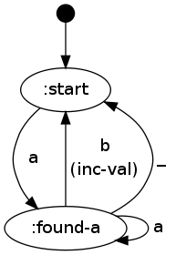

# reduce-fsm

## Features
reduce-fsm provides a simple way to specify clojure [finite state machines](http://en.wikipedia.org/wiki/Finite-state_machine), it allows you to:

- Define define state machines that accumulate values (in the same was that reduce does)
- Create lazy sequences from state machines
- Perform stateful filtering with clojures filter/remove functions
- Visualize the resulting state machines with graphviz

All generated state machines are plain clojure functions and read events from clojure sequences.
Events are dispatched with core.match and allws the use of all match features (guards, destructuring, regex matching, etc.)


## Usage
The fastest way to use this library is with Leiningen or Cake. Add the following to your project.clj dependencies:

```clojure
[cdorrat/reduce-fsm "0.1.0-SNAPSHOT"]
```

Use via:

```clojure
(require '[reduce-fsm :as fsm])
```

## Examples
The following example counts the number of times "ab" occurs in a sequence.

```clojure
(defn inc-val [val & _] (inc val))

(fsm/defsm count-ab
  [[:start
    \a -> :found-a]
   [:found-a
    \a ->  :found-a
    \b -> {:action inc-val} :start
    _ -> :start]])

;; The following repl session demostrates using the generated fsm.
;;
;; => (map (partial count-ab 0) ["abaaabc" "aaacb" "bbbcab"])
;; (2 0 1)
;; => (show-fsm count-ab)
;; displays the fsm diagram below

```



## Documentation


## License

Copyright (C) 2011 Cameron Dorrat

Distributed under the Eclipse Public License, the same as Clojure.
